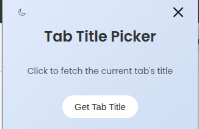
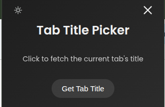

# Chrome Tab Title Extension

This Chrome extension displays the current tab's title in a visually clean popup. It includes theme toggle functionality (light and dark modes) and a close button for improved user interaction.

## Features

- Fetches and displays the active browser tab's title
- Light and dark mode toggle
- Cross (close) icon to hide the popup
- Smooth transitions and responsive design
- Clean, modern UI with gradient backgrounds

## Preview

### Light Theme  

### Dark Theme  

## How to Use

1. Clone or download the repository:
   
   git clone https://github.com/kunikasirpor/chrome-tab-title-extension.git
   
3. Open Chrome and go to:
   
   chrome://extensions/
   
5. Enable Developer Mode (toggle in the top right corner)

6. Click Load unpacked and select the cloned folder

7. Click the extension icon in the Chrome toolbar to open the popup
